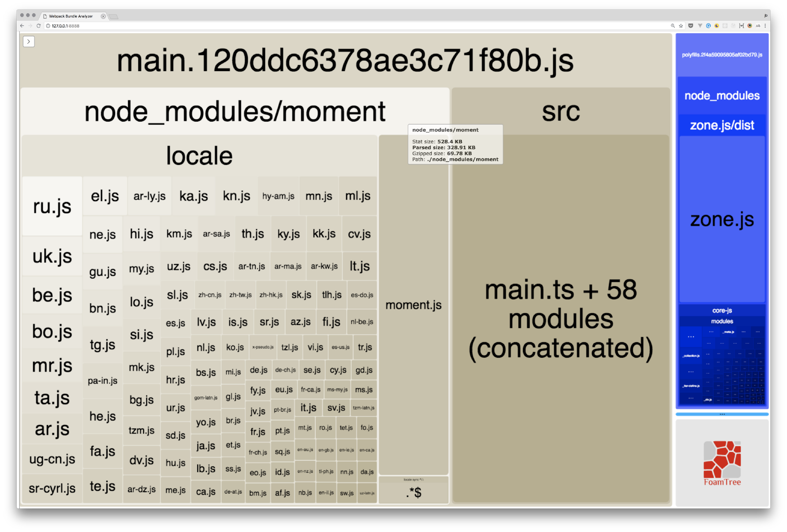
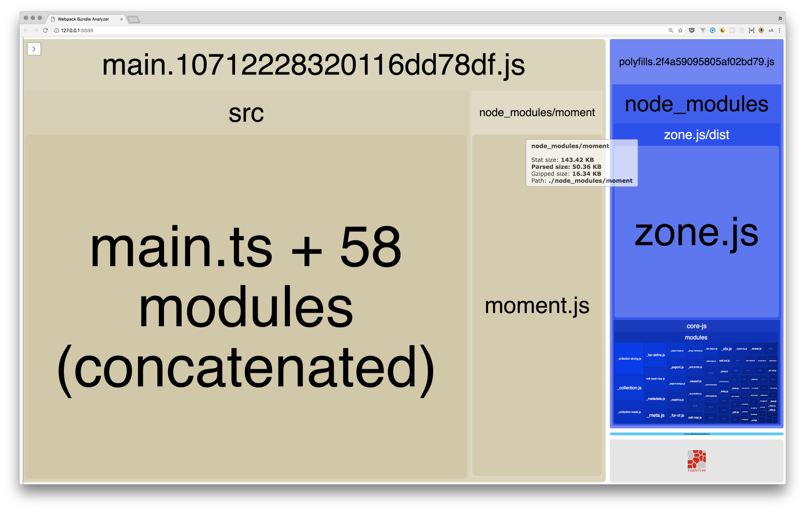

When I wrote about
[“To use Angular CLI or not?”](https://medium.jonasbandi.net/to-use-angular-cli-or-not-187f87d0b550),
I claimed that there was not much risk involved in starting a project with
Angular CLI, since `ng eject` allowed you to change your mind later and jump to
a vanilla Webpack setup.

This has changed since AngularCLI 6: the `eject` command is now disabled.

> Relying on Angular CLI has just become a much bigger risk for your project.

When I wrote about
[“Angular vs. React: The CLI”](https://medium.jonasbandi.net/angular-vs-react-the-cli-d8af18063006)
I claimed that I have not yet had a mandatory reason to `eject`. In the meantime
I have come across several cases where the is a need to modify the webpack
config of an Angular CLI project, which could be achieved with`eject` … but not
any more.

One reasons is an integration with [three.js](https://threejs.org/). Many
three.js extension rely on the global variable `THREE`.
[The typical solution](https://gist.github.com/cecilemuller/0be98dcbb0c7efff64762919ca486a59)
in a webpack build is to expose `THREE` globally
[via webpack config](https://webpack.js.org/plugins/provide-plugin/)… bad luck,
with Angular CLI v6 you don’t have that option any more. Other solutions
[are much more hacky](https://github.com/jbandi/angulr-three-project-demo/commit/c492e60e3c84e91c120654aba273350ca771ca9a)
…

Another nasty example where you typically need access to the webpack
configuration is when you want to use the popular library
[Moment.js.](http://momentjs.com/)

Let me illustrate the problem:

```
npx @angular/cli@6.1 new my-project
cd my-project
npm i moment @types/moment
```

Now use _Moment.js_ in your project, i.e. in `main.ts` :

```javascript
import * as moment from 'moment'
console.log(moment())
```

Now run the build and have look at the bundle:

```
npm run build -- --prod --stats-json
npx webpack-bundle-analyzer dist/my-project/stats.json
```

You get the following scary picture:



The main bundle of your application has a size of 498 KB of which Moment.js is
329 KB! The biggest part of Moment.js consists of a bunch of locales, which you
most probably do not need!

Of course this is a shortcoming of Moment.js in combination with webpack. This
is not inherently a problem of the Angular CLI. However Moment.js is a very
popular library, many Angular projects want/need to use it. Maybe only because
some other library depends on Moment.js (many do!).

There is an easy fix for the problem: how-to-optimize-momentjs-with-webpack.
However you need to modify the webpack config… which is not possible in a plain
Angular CLI project! Bummer!

The answer of the Angular CLI is: that this is unfortunate, but they can’t deal
with such special cases… bummer again! Note: `create-react-app` accepts that
Moment.js, as a very common library, deserves special handling and solves the
problem out of the box.

> At this point your project has a problem…

Of course the JavaScript ecosystem has a solution for everything:

<blockquote class="twitter-tweet" data-conversation="none" data-theme="light"><p lang="en" dir="ltr">Monkey patch node_modules with <a href="https://t.co/p7p7L5FtDi">https://t.co/p7p7L5FtDi</a></p>&mdash; Wayne Maurer (@waynemaurer) <a href="https://twitter.com/waynemaurer/status/1032249602597167104?ref_src=twsrc%5Etfw">August 22, 2018</a></blockquote>

… but I don’t like that a “state-of-the-art” framework forces me into hacks like
this.

### A solution (sort of …)

<blockquote class="twitter-tweet" data-conversation="none"><p lang="en" dir="ltr"><a href="https://t.co/1ObTgoXZ2L">https://t.co/1ObTgoXZ2L</a> use this if you want to override config for some library without ejecting.</p>&mdash; Rob Wormald (@robwormald) <a href="https://twitter.com/robwormald/status/1032328718272757761?ref_src=twsrc%5Etfw">August 22, 2018</a></blockquote>

With [ngx-build-plus](https://github.com/manfredsteyer/ngx-build-plus) you can
change the webpack configuration in an Angular CLI project without ejecting.

_(Note: The section below was updated on 2018–12–29 for Angular CLI 7.1.4)_

In the example from above you can do the following:

```
ng add ngx-build-plus
```

Add a file `webpack.extra.js` in the root of your project:

```javascript
const webpack = require('webpack')
module.exports = {
  plugins: [new webpack.IgnorePlugin(/^\.\/locale$/, /moment$/)],
}
```

And run:

```
npm run build -- --prod --stats-json --extra-webpack-config webpack.extra.js
npx webpack-bundle-analyzer dist/my-project/stats.json
```

Yay! All the locales have disappeared from the bundle:



You have now solved the problem! … But did you consider the price of the
solution?

> At best I can congratulate someone for quickly and simply solving a problem on
> top of the shit that they are given. The only software that I like is one that
> I can easily understand and solves my problems. _-_ >
> [Ryan Dahl on Software](https://gist.github.com/cookrn/4015437)

Yup, `ngx-build-plus` is yet another “arcane” library you now depend on. Are you
prepared to maintain that library yourself?
