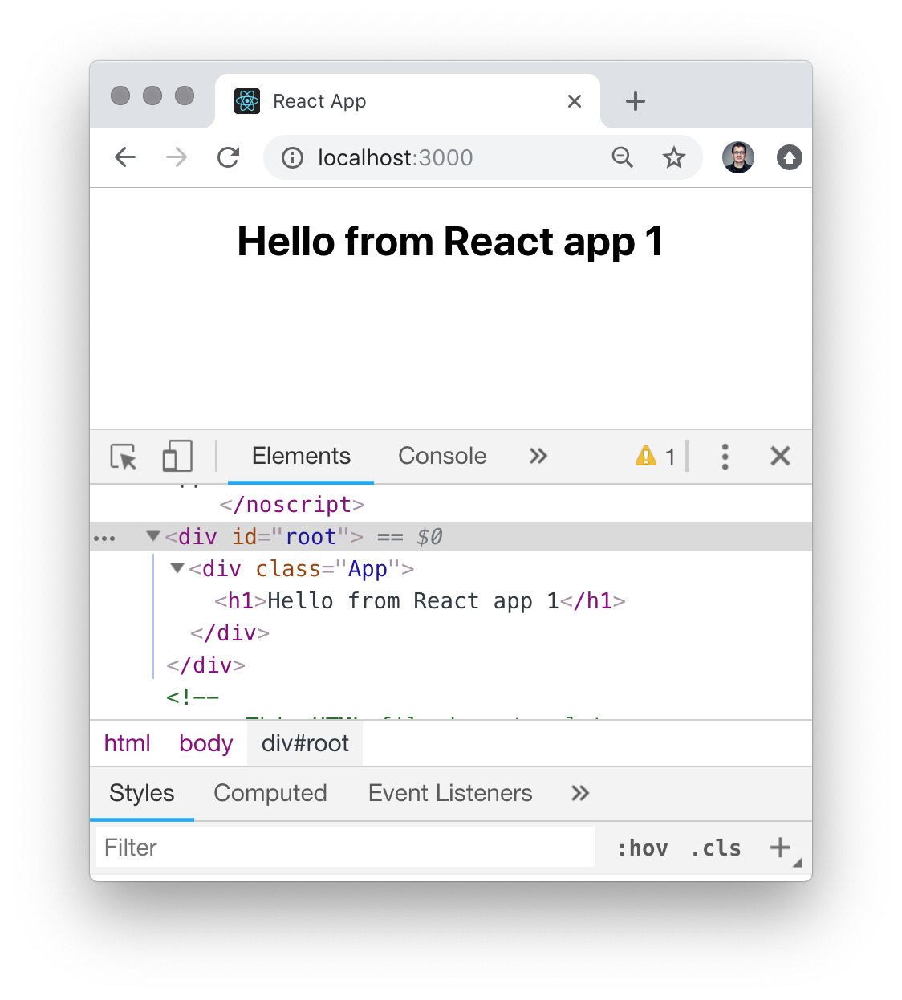
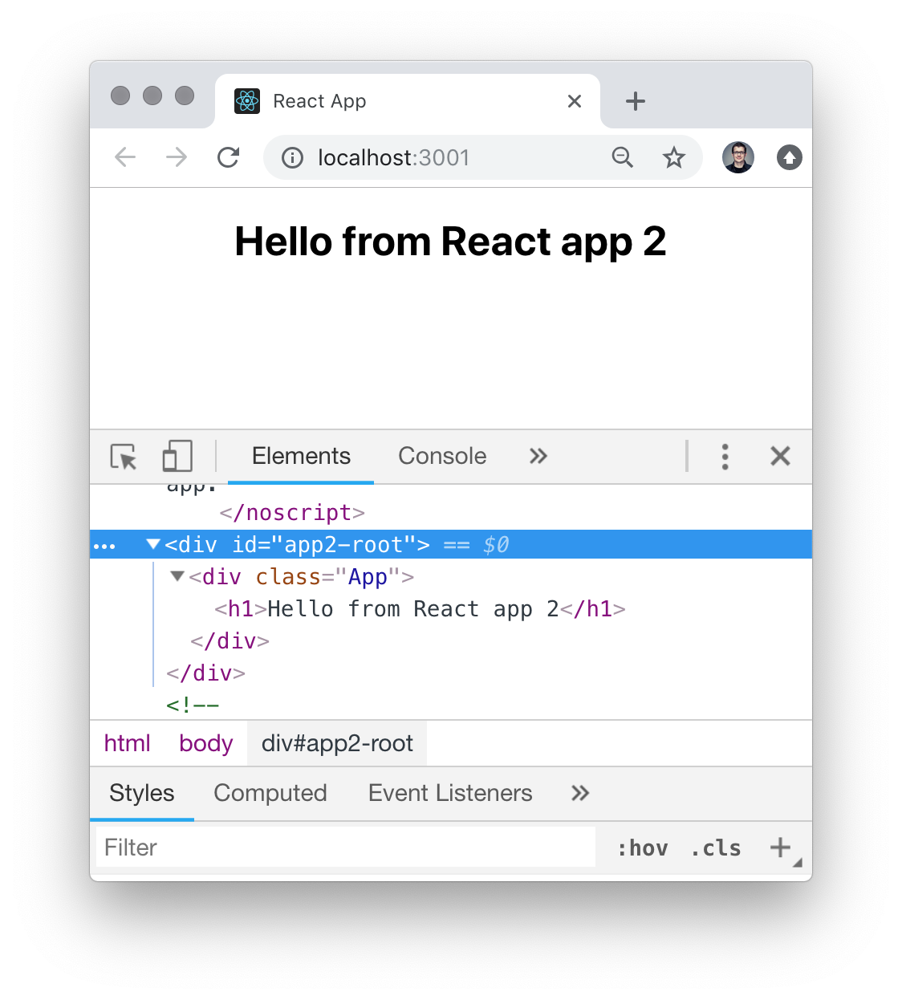
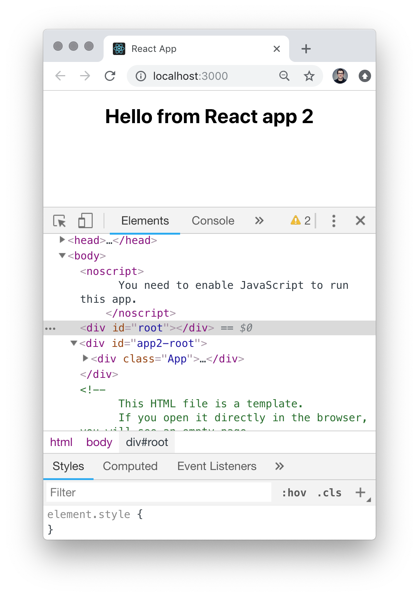
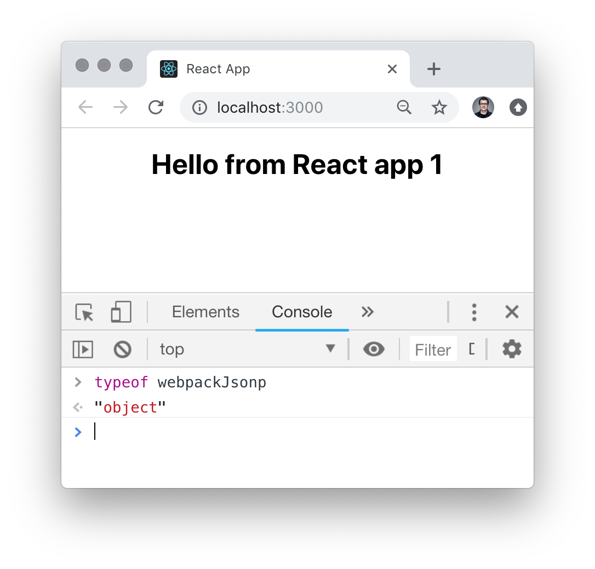
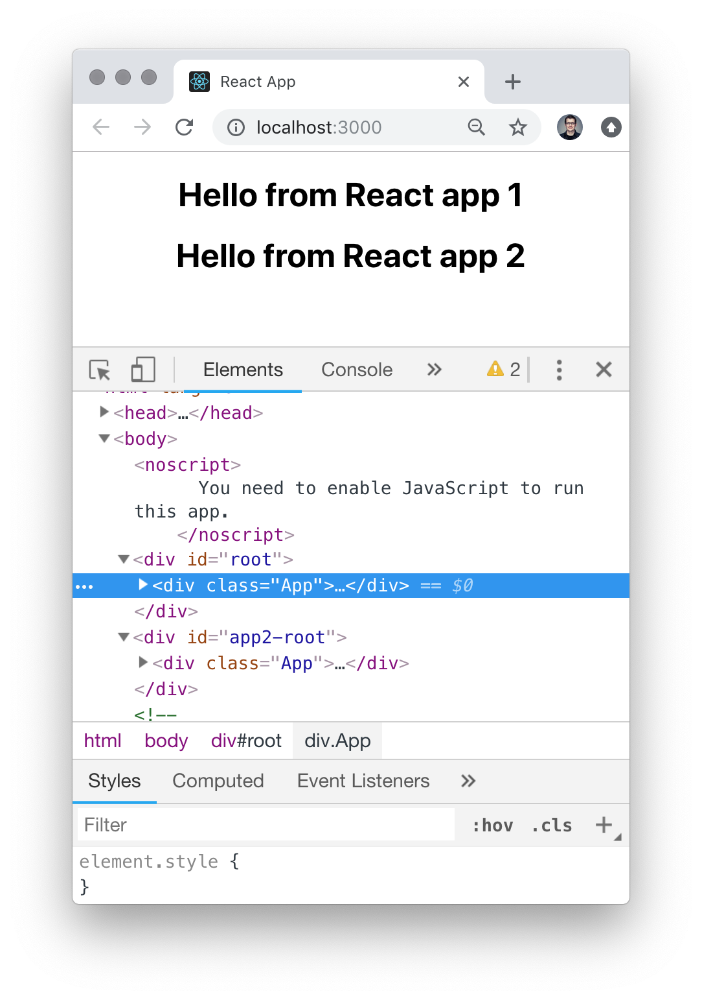

One simple/naive approach to break up a big single page application is to split
it into different single page applications which then are loaded on the same
html document.

Unfortunately it is not possible to run several create-react-app applications on
the same document., because the JavaScript bundles resulting from a cra project
is not without side-effects: The bundled WebPack runtime writes an object on the
global scope, which prevents to load several such bundles.

The following steps illustrate the problem and show how to fix it:

## The Setup

```bash
npx create-react-app react-app1 --use-npm
npx create-react-app react-app2 --use-npm
```

Changing the second React app to run on another port in development mode:

```js
// package.json
scripts: {
	"start":"PORT=3001 react-scripts start"
..}
```

Change the DOM node on which the second React app is bootstrapped:

```html
<!-- index.html -->
<div id="app2-root"></div>
```

```js
// index.js
ReactDOM.render(<App />, document.getElementById('app2-root'))
```

Run the first React application:

```bash
cd react-app1
npm start
```



Run the second React application:

```bash
cd react-app2
npm start
```



Load the second React app on the document of the first React app:

```html
// index.html
<div id="app2-root"></div>

<script src="http://localhost:3001/static/js/bundle.js"></script>
<script src="http://localhost:3001/static/js/1.chunk.js"></script>
<script src="http://localhost:3001/static/js/main.chunk.js"></script>
```

Unfortunately this does not have the expected result: We only see the second
React app bootstrapped on the page. 

## The Problem

Somehow loading the scripts of the second React app has a side effect and
prevents the bootstrapping of the first React app!

It turns out that the WebPack runtime is the problem here. The WebPack runtime
adds an object to the global scope which is used to lazy-load chunks. The
default name for this function is `webpackJsonp`.


## The Solution

The name of this object can be
[configured in the WebPack config](https://webpack.js.org/configuration/output/#output-jsonpfunction).

To get access to the WebPack config of a create-react-app project, you need to
[eject](https://github.com/facebook/create-react-app/blob/master/packages/react-scripts/template/README.md#npm-run-eject)
or use another customization mechanism like
[customize-cra](https://github.com/arackaf/customize-cra).

Then you can change the Webpack config like this:

```js
// webpack.config.dev.json
...
output {
	...
	jsonpFunction: 'jsonpApp2'
}
```

Once you have changed the `jsonpFunction` of your second React app to a unique
value, you must restart the development server (`npm start`)

Make sure that the document of the first app still references the correct
scripts from the second app. Sometimes WebPack decides to rename the chunks…

And voilà: Both applications are bootstrapped on the same document:


Note: I only showed here how to adjust the WebPack configuration for the
development build. The same change is needed for the production WebPack
configuration. For production the project also has to solve the challenge of
adding the correct script names to the integrating document, since WebPack (i.e
in create-react-app) is configured to add a hash of the script content to the
script name.
